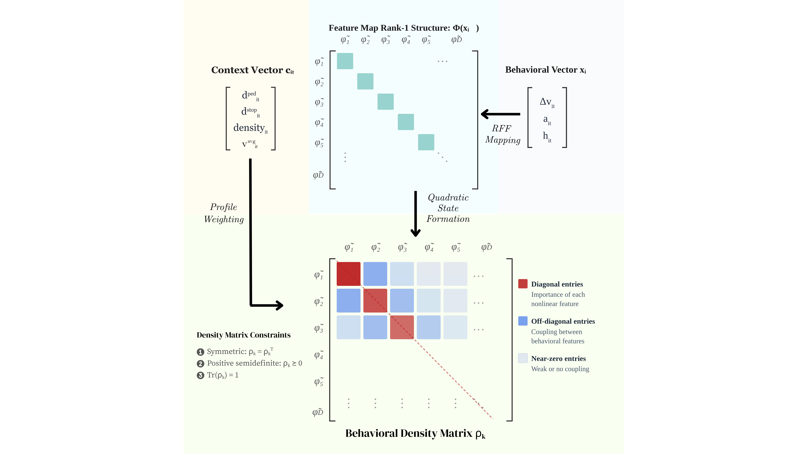

# Behavioral Heterogeneity as Quantum-Inspired Representation

> A quantum-inspired framework for modeling driver behavior as continuous dynamic states rather than static categories.

[](https://arxiv.org/abs/2603.22729)

**Authors:** Mohammad Elayan & Wissam Kontar (2026)

---

## 🎯 Key Idea

Traditional driver classification uses rigid labels (*aggressive*, *timid*, etc.). This framework instead models behavior as:

- **Dynamic latent states** represented by density matrices
- **Continuous transitions** between behavioral modes
- **Context-sensitive** responses to traffic conditions

## 🧩 Framework Components



```
Behavioral Features → RFF Embedding → Density Matrix → Context Weighting
    (speed, accel,       (nonlinear        (feature         (traffic
     headway)            projection)      interactions)     context)
```

### Pipeline Stages

1. **Feature Extraction** — Speed differences, acceleration, headway
2. **Nonlinear Embedding** — Random Fourier Features (RFF) mapping
3. **Density Matrix** — Symmetric, positive semi-definite representation
   - *Diagonal*: Feature importance
   - *Off-diagonal*: Feature interactions
4. **Context Integration** — Distance to pedestrians, stop distance, traffic density, average speed

---

## 📊 Data

We use **TGSIM (Third Generation Simulation)** datasets:

| Dataset | Link |
|---------|------|
| Foggy Bottom | [data.gov/tgsim-foggy-bottom](https://catalog.data.gov/dataset/third-generation-simulation-data-tgsim-foggy-bottom-trajectories) |
| I-395 | [data.gov/tgsim-i-395](https://catalog.data.gov/dataset/third-generation-simulation-data-tgsim-i-395-trajectories) |

> ⚠️ **Note:** Raw and processed datasets are not included due to size constraints. You must download and process them locally.

---

## 🔄 Reproducibility

### Step 1: Download Data
Retrieve raw TGSIM datasets from the links above.

### Step 2: Process Trajectories
```bash
# Run data preprocessing notebooks
jupyter notebook dataset_creation_FB.ipynb
jupyter notebook dataset_creation_I395.ipynb
```

These notebooks extract behavioral features and prepare profiling inputs.

### Step 3: Run Profiling
```bash
python quantum_driver_profiling.py
```

---

## 🚀 Applications

While currently applied to the TGSIM datasets, this framework is **dataset-agnostic** and integrates with:

- Any dataset with basic kinematics
- Any set of behavior and context variables

---

## 📄 Citation

```bibtex
@article{elayankontar2026quantum,
  title={Behavioral Heterogeneity as Quantum-Inspired Representation},
  author={Elayan, Mohammad and Kontar, Wissam},
  journal={arXiv preprint arXiv:2603.22729},
  year={2026}
}
```

---

## 📧 Contact

- **Mohammad Elayan** — melayan2@nebraska.edu
- **Wissam Kontar** — wkontar2@nebraska.edu
